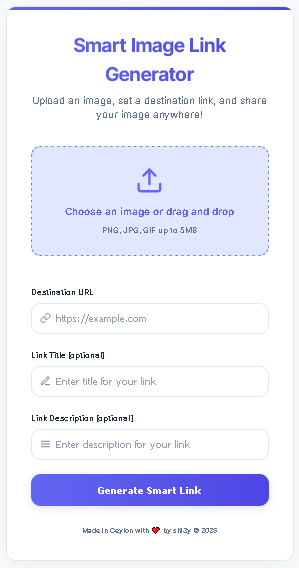

# Smart Image Link Generator

A modern web application that allows users to create smart image links with custom destinations. When someone clicks on the image, they'll be redirected to your specified URL. Perfect for social media sharing, marketing campaigns, or creating engaging image-based links.



## 🌟 Features

- **Modern UI/UX**: Beautiful, responsive design that works on all devices
- **Drag & Drop**: Easy image upload with drag and drop support
- **Custom Metadata**: Set custom titles and descriptions for your links
- **QR Code Generation**: Automatically generates QR codes for easy sharing
- **Mobile Optimized**: Fully responsive design with touch-friendly interactions
- **Open Graph Support**: Perfect for social media sharing
- **Fast Loading**: Optimized for quick loading and smooth performance

## 🚀 Live Demo

[Try it out here](https://smartlink.isuru.eu.org)

## 🛠️ Tech Stack

- **Frontend**: HTML5, CSS3, JavaScript (Vanilla)
- **Backend**: Cloudflare Workers
- **Database**: Supabase (PostgreSQL)
- **Storage**: Supabase Storage

## 📋 Prerequisites

Before you begin, ensure you have:

1. A [Supabase](https://supabase.com) account
2. A [Cloudflare](https://cloudflare.com) account
3. [Wrangler CLI](https://developers.cloudflare.com/workers/wrangler/install-and-update/) installed

## 🔧 Setup Instructions

### 1. Database Setup (Supabase)

1. Create a new Supabase project
2. Create the following table in your database:

```sql
create table image_links (
  id bigint generated by default as identity primary key,
  public_id text unique not null,
  filename text not null,
  destination text not null,
  og_title text,
  og_description text,
  created_at timestamp with time zone default timezone('utc'::text, now()) not null
);

-- Create an index for faster lookups
create index image_links_public_id_idx on image_links(public_id);
```

3. Create a new storage bucket named `images` with the following settings:
   - Public bucket
   - File size limit: 5MB
   - Allowed mime types: image/*

### 2. Cloudflare Workers Setup

1. Install Wrangler CLI:
```bash
npm install -g wrangler
```

2. Login to Cloudflare:
```bash
wrangler login
```

3. Create a new worker:
```bash
wrangler init smart-image-link-generator
```

4. Configure your worker by creating a `wrangler.toml` file:
```toml
name = "smart-image-link-generator"
main = "index.js"
compatibility_date = "2024-01-01"

[vars]
# Add your environment variables here
# SUPABASE_URL = "your_supabase_url"
# SUPABASE_ANON_KEY = "your_supabase_anon_key"
```

### 3. Environment Variables

Set up your environment variables in Cloudflare Workers:

1. Go to Cloudflare Dashboard
2. Navigate to Workers & Pages
3. Select your worker
4. Go to Settings > Variables
5. Add the following variables:
   - `SUPABASE_URL`: Your Supabase project URL
   - `SUPABASE_ANON_KEY`: Your Supabase anonymous key

## 🚀 Deployment

1. Push your code to GitHub
2. Deploy using Wrangler:
```bash
wrangler deploy
```

Or deploy through Cloudflare Dashboard:
1. Go to Workers & Pages
2. Click "Create Application"
3. Choose "Pages"
4. Connect your GitHub repository
5. Configure build settings:
   - Build command: (leave empty)
   - Build output directory: (leave empty)
6. Deploy!

## 🔒 Security Considerations

1. **Rate Limiting**: Implement rate limiting to prevent abuse
2. **File Validation**: Validate file types and sizes
3. **URL Validation**: Ensure destination URLs are valid and safe
4. **CORS**: Configure CORS headers appropriately
5. **Environment Variables**: Never commit sensitive keys to version control

## 📝 API Documentation

### Endpoints

1. **GET /** - Serves the main application
2. **GET /i/:publicId** - Serves the redirect page
3. **POST /upload** - Handles image uploads

### Request/Response Examples

#### Upload Image
```http
POST /upload
Content-Type: multipart/form-data

{
  "image": [binary file],
  "destination": "https://example.com",
  "ogTitle": "Custom Title",
  "ogDescription": "Custom Description"
}
```

Response:
```json
{
  "imageUrl": "https://your-domain.com/i/abc123"
}
```

## 🤝 Contributing

1. Fork the repository
2. Create your feature branch (`git checkout -b feature/AmazingFeature`)
3. Commit your changes (`git commit -m 'Add some AmazingFeature'`)
4. Push to the branch (`git push origin feature/AmazingFeature`)
5. Open a Pull Request

## 📄 License

This project is licensed under the MIT License - see the [LICENSE](LICENSE) file for details.

## 🙏 Acknowledgments

- [Supabase](https://supabase.com) for the backend infrastructure
- [Cloudflare](https://cloudflare.com) for the deployment platform
- [Inter](https://rsms.me/inter/) for the beautiful font
- [QRCode.js](https://github.com/davidshimjs/qrcodejs) for QR code generation

## 📞 Support

If you need help or have questions:

1. Open an issue in the GitHub repository
2. Contact: your-email@example.com
3. Join our [Discord community](https://discord.gg/sh13y-server)

## 🔄 Updates

- **v1.0.0** - Initial release
- **v1.1.0** - Added QR code generation
- **v1.2.0** - Improved mobile responsiveness
- **v1.3.0** - Added drag and drop support

---

Made in with ❤️ by sh13y